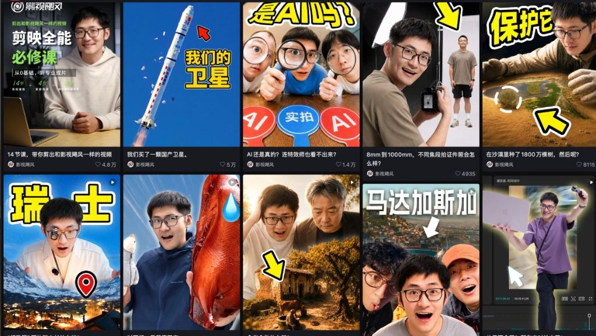

# 小红书封面生成器 - Codex Skill

在 Codex 中直接生成或修改小红书封面。推荐安装到 Codex，这样可以优先调用 Codex 的 GPT Image 2 / 图片生成能力；Gemini 命令行脚本保留为备用方案。

**GitHub 仓库**：[sammyteng/xhs-cover-skill](https://github.com/sammyteng/xhs-cover-skill)

---

## 效果预览

支持 22 种预设风格，覆盖职场、居家、综艺、文艺等各类场景：


> 在 Codex 中选择风格后，Skill 会自动完成上图中所有配置步骤，直接输出封面图片。

---

## 前置要求

- Codex（推荐，可直接调用 Codex 的 GPT Image 2 / 图片生成能力）
- Node.js 18+（仅 Gemini CLI 备用方案和命令行脚本需要，macOS / Linux / Windows 均支持）

---

## 安装

**Codex（推荐）：**

```bash
git clone https://github.com/Vivixiao980/xhs-cover-skill ~/.codex/skills/xhs-cover-skill
cd ~/.codex/skills/xhs-cover-skill && npm install
```

重启 Codex 后，Skill 自动生效。在 Codex 中使用时，默认优先走 Codex 自带的图片生成/编辑能力，不需要先配置 Gemini API。

如果只使用 Codex 主流程，`npm install` 可以跳过；安装依赖是为了启用 Gemini CLI 备用方案和直接命令行脚本。

**Claude Code / Gemini CLI 备用方案：**

```bash
git clone https://github.com/Vivixiao980/xhs-cover-skill ~/.claude/skills/xhs-cover
cd ~/.claude/skills/xhs-cover && npm install
```

重启 Claude Code 后，Skill 自动生效。没有 Codex 图片生成能力时，会回落到 Gemini API 命令行流程。

**OpenClaw：**

```bash
git clone https://github.com/Vivixiao980/xhs-cover-skill ~/.openclaw/skills/xhs-cover
cd ~/.openclaw/skills/xhs-cover && npm install
```

然后在 OpenClaw 配置中添加 API Key（可替代 Onboarding 流程）：

```yaml
# ~/.openclaw/config.yaml
skills:
  entries:
    xhs-cover:
      env:
        XHS_COVER_API_KEY: "你的 API Key"
        XHS_COVER_BASE_URL: "https://generativelanguage.googleapis.com/v1beta/openai"
        XHS_COVER_MODEL: "gemini-2.0-flash-exp-image-generation"
```

**或者使用安装脚本（自动检测平台）：**

```bash
curl -fsSL https://raw.githubusercontent.com/sammyteng/xhs-cover-skill/main/install.sh | bash
```

---

## 使用方法

在 Codex 中输入任意触发词即可：

```
生成封面
小红书封面
制作封面
xhs封面
修改封面
```

安装在 Codex 中时，Skill 会优先使用 Codex 图片生成/编辑能力。只有在明确使用 Gemini CLI 备用方案，或当前环境没有可用图片生成能力时，才需要完成下面的 API 配置。

---

## API 配置（Gemini CLI 备用方案）

Codex 推荐流程不需要单独配置 Gemini API。以下配置仅用于命令行脚本或 Gemini CLI 备用方案。

### 方案 A：Google AI Studio

1. 访问 [aistudio.google.com/apikey](https://aistudio.google.com/apikey) 创建 API Key
2. 在 Skill Onboarding 中选择「Google AI Studio」，粘贴 Key 即可

> **关于免费**：Google AI Studio 有免费层级（无需绑卡），但**图片生成**功能是否在免费额度内会随 Google 的策略调整，建议在 [ai.google.dev/gemini-api/docs/pricing](https://ai.google.dev/gemini-api/docs/pricing) 确认最新情况。需要科学上网。

> **关于模型名称**：Gemini 图片生成模型的 API 名称会随版本迭代变化，请在 [ai.google.dev/gemini-api/docs/models](https://ai.google.dev/gemini-api/docs/models) 确认当前支持图片输出的模型名。

### 方案 B：第三方 API 代理

支持任意兼容 OpenAI 格式的代理服务（无需科学上网，按量付费）。按需自行选择服务商，配置时提供 Base URL、API Key 和模型名称即可。

配置文件保存在 `~/.config/xhs-cover/config.json`：

```json
{
  "apiType": "third-party",
  "apiKey": "your-api-key",
  "baseUrl": "https://your-provider.com",
  "model": "gemini-3-pro-image-preview",
  "outputDir": "~/Desktop/XHS封面",
  "defaultAspectRatio": "3:4"
}
```

---

## 命令行直接使用

也可以绕过 Skill，直接调用脚本：

```bash
node ~/.codex/skills/xhs-cover-skill/scripts/generate.mjs \
  --image "/path/to/photo.jpg" \
  --style "hand-drawn-border" \
  --title "你的封面大标题" \
  --subtitle "副标题（可选）" \
  --aspect-ratio "3:4" \
  --count 1
```

**支持的参数：**

| 参数 | 说明 | 默认值 |
|------|------|--------|
| `--image` | 人物照片路径（必填） | - |
| `--style` | 风格ID（必填，见下方列表） | - |
| `--title` | 主标题（必填） | - |
| `--subtitle` | 副标题 | 空 |
| `--extra` | 额外要求 | 空 |
| `--count` | 生成数量（最多5） | 1 |
| `--aspect-ratio` | 比例：3:4 / 1:1 / 9:16 / 4:3 | 3:4 |
| `--output-dir` | 保存目录 | ~/Desktop/XHS封面 |
| `--api-key` | API Key | 读配置文件 |
| `--base-url` | API Base URL | 读配置文件 |
| `--api-endpoint` | 完整端点URL（Google适用） | 读配置文件 |
| `--model` | 模型名称 | 读配置文件 |
| `--rotate` | 手动旋转：90/180/270 | 自动EXIF |
| `--no-auto-orient` | 跳过EXIF自动旋转 | false |
| `--test` | 只测试API连通性 | false |

---

## 风格列表

<table>
  <tr>
    <td align="center" width="33%">
      <br>
      <b>手绘边框</b> <code>hand-drawn-border</code><br>
      <sub>黄色手绘描边，综艺活力感</sub>
    </td>
    <td align="center" width="33%">
      <br>
      <b>户外手写</b> <code>outdoor-handwriting</code><br>
      <sub>竖排毛笔黄字，清新自由感</sub>
    </td>
    <td align="center" width="33%">
      <br>
      <b>霓虹撞色</b> <code>neon-contrast</code><br>
      <sub>荧光粉绿大胆撞色，Y2K潮流</sub>
    </td>
  </tr>
  <tr>
    <td align="center">
      <br>
      <b>多层排版</b> <code>multi-layer-layout</code><br>
      <sub>黑橙混排，杂志编辑风格</sub>
    </td>
    <td align="center">
      <br>
      <b>书房知性</b> <code>study-room-intellectual</code><br>
      <sub>奶油色手写字，温暖智慧感</sub>
    </td>
    <td align="center">
      <br>
      <b>职场女性</b> <code>professional-woman</code><br>
      <sub>奶黄大字+红色虚线，赋能感</sub>
    </td>
  </tr>
  <tr>
    <td align="center">
      <br>
      <b>贴纸活力</b> <code>sticker-energy</code><br>
      <sub>人物抠图贴纸效果，闪电星星装饰</sub>
    </td>
    <td align="center">
      <br>
      <b>虚线装饰</b> <code>dashed-decoration</code><br>
      <sub>白字橙副标，虚线半圆环绕</sub>
    </td>
    <td align="center">
      <br>
      <b>背景大字</b> <code>background-big-text</code><br>
      <sub>超大橙字作背景，人物前景</sub>
    </td>
  </tr>
  <tr>
    <td align="center">
      <br>
      <b>思考提问</b> <code>thinking-question</code><br>
      <sub>蓝灰毛笔字，问号设计</sub>
    </td>
    <td align="center">
      <br>
      <b>分屏标签</b> <code>split-screen-tags</code><br>
      <sub>上图下色块，黄蓝配色</sub>
    </td>
    <td align="center">
      <br>
      <b>温馨居家</b> <code>cozy-home</code><br>
      <sub>黄白渐变字+椭圆高亮</sub>
    </td>
  </tr>
  <tr>
    <td align="center">
      <br>
      <b>职场大字</b> <code>workplace-big-text</code><br>
      <sub>白色超大字叠人物，冲击力</sub>
    </td>
    <td align="center">
      <br>
      <b>深色发光</b> <code>dark-glow</code><br>
      <sub>深色背景+黄色发光文字</sub>
    </td>
    <td align="center">
      <br>
      <b>居家励志</b> <code>home-motivation</code><br>
      <sub>亮黄大字，开放姿势场景</sub>
    </td>
  </tr>
  <tr>
    <td align="center">
      <br>
      <b>黄粉横幅</b> <code>yellow-pink-banner</code><br>
      <sub>黄字顶部+粉色横幅底部</sub>
    </td>
    <td align="center">
      <br>
      <b>粉黄俏皮</b> <code>pink-yellow-playful</code><br>
      <sub>波浪英文+手写中文，可爱</sub>
    </td>
    <td align="center">
      <br>
      <b>专业简洁</b> <code>professional-clean</code><br>
      <sub>白字简洁，现代办公场景</sub>
    </td>
  </tr>
  <tr>
    <td align="center" width="33%">
      <br>
      <b>科技财经分析</b> <code>tech-finance-analytical</code><br>
      <sub>倾斜大字发光阴影，实景/博弈背景，专业深度感</sub>
    </td>
    <td align="center" width="33%">
      <br>
      <b>AI大头贴</b> <code>ai-avatar-sticker</code><br>
      <sub>大头 Q 版人像，3D卡通场景，黑体粗边高对比字</sub>
    </td>
    <td align="center" width="33%">
      <br>
      <b>极客工作流</b> <code>geek-workflow-dialog</code><br>
      <sub>电光蓝渐变标题，毛玻璃输入框，手写英文点缀</sub>
    </td>
  </tr>
  <tr>
    <td align="center">
      <br>
      <b>影视飓风</b> <code>hurricane-adventure</code><br>
      <sub>趣味夸张表情，手绘黄色大指示箭头，极粗包边字</sub>
    </td>
    <td align="center">
    </td>
    <td align="center">
    </td>
  </tr>
</table>

---

## 注意事项

- 图片会自动读取 EXIF 方向信息并旋转（手机拍摄的竖版照片无需手动处理）
- 图片超过 4MB 会自动压缩
- 建议每次生成间隔 8 秒以上，避免 API 连接问题
- 生成耗时约 30-60 秒

---

## 贡献指南

欢迎提交 PR！以下几类贡献特别受欢迎：

### 新增风格
在 `styles/` 目录下新建一个 JSON 文件（如 `styles/my-style.json`）：

```json
{
  "name": "风格中文名",
  "prompt": "详细的中文设计提示词..."
}
```

参考现有风格格式，确保包含【布局要求】【文字样式】【核心特效】【禁止事项】【氛围】几个区块。同时附上一张效果参考图放到 `assets/styles/` 目录。

### 改进现有提示词
如果你发现某个风格生成效果不好（比如文字乱码、构图不对），欢迎直接修改对应的 `prompt` 并附上改进前后的对比截图。

### 其他贡献
- 增加新的图片处理功能（如自动抠图、滤镜）
- 支持更多 API 提供商
- 改进 Onboarding 流程
- 修复 Bug

提交 PR 前请简单描述改动内容，如有效果图更好！

---

## License

MIT — 作者：[sammyteng](https://github.com/sammyteng/xhs-cover-skill)
